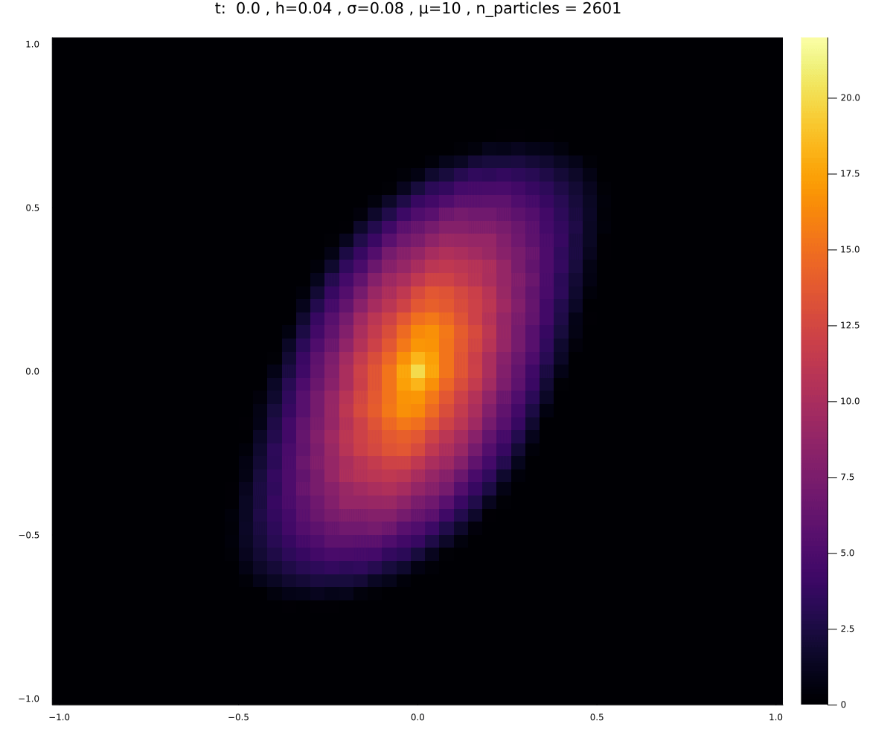

# Overview
This is a solver for the vorticity transport equation. The vorticity equations are the Navier-Stokes equations decomposed into a linear transport equations and a Laplace equation.

 

    
    
<em>This result was generated with this solver. It shows the evolution of vorticities.
  </em>

 

The vorticity equations are given by : 
$$ \frac{\partial\omega}{\partial t} + (\vec{u}\cdot\nabla)\omega = 0 $$
$$ \nabla \cdot \vec{u} = 0, \nabla \times \vec{u}= \omega $$

with the initial data and boundary conditions:

$$ \omega (0,\vec{x}) = \omega_0(\vec{x}) $$
$$ \vec{u} \rightarrow \vec{0} \quad \text{for} \quad |\vec{x}| \rightarrow \infty $$

The shown results are generated with elliptical initial conditions:
$$ \omega_0(\vec{x}) = 
  \begin{cases}
    20 (1 - \frac{|\vec{x}|}{0.8})  & |\vec{x}| < 0.8,\\
    0 & else  
  \end{cases} $$

# Numerical Method
The vorticity equations are solved via a particle method with using kernel-based interpolation. One advantage of particle methods, are their semi-analytical nature. The vorticity can be computed exact and from this, the velocity vector will be computed. 
The evolution of the particles is given by :
$$
\begin{align*}
    \frac{d\vec{x}_i}{dt} &= \vec{u}_{h,\sigma}(t,\vec{x}_i(t))\\
    \frac{d\omega_i}{dt} &= \mu\Delta\omega_{h,\sigma}(t,\vec{x}_i(t))\\
\end{align*}
    
$$
The viscosity of the Navier-Stokes equations can be modeled using the $\mu$ parameter. The trajectories of the particles can be computed using any Runge Kutta scheme.

$\vec{u}_{h,\sigma}(t,\vec{x}_i(t))$ and $\omega_{h,\sigma}(t,\vec{x}_i(t))$ are the interpolation functions that are used to evaluate the field outside the particles.
$$
\begin{align*}
    \omega_{h,\sigma}(t,\vec{x}_i(t)) &= \sum_{i=1}^{N}\zeta_\sigma(\vec{x}-\vec{x}_i)c_i \\
    \vec{u}_{h,\sigma}(t,\vec{x}_i(t)) &= \sum_{i=1}^{N} \vec{K}_\sigma(\vec{x}-\vec{x}_i)c_i
\end{align*}
$$

The $c_i$ coefficients are the solution to the following eigenvalues problem, which can be interpreted as a sort of least squares problem:

$$
    \begin{pmatrix}
        \zeta_σ(\vec{x}_1 − \vec{x}_1 ) & \zeta_σ(\vec{x}_1 − \vec{x}_2) & \dots & \zeta_σ(\vec{x}_1 − \vec{x}_N ) \\
        \zeta_σ(\vec{x}_2 − \vec{x}_1) & \zeta_σ(\vec{x}_2 − \vec{x}_2) & \dots & \zeta_σ(\vec{x}_2− \vec{x}_N ) \\
        \vdots  & \vdots  & &\vdots
    \end{pmatrix}
    \begin{pmatrix}
        c_1 \\
        c_2 \\
        \vdots
    \end{pmatrix}
    =
    \begin{pmatrix}
       \omega_1 \\
       \omega_2 \\
       \vdots 
    \end{pmatrix}
$$
where $\zeta_\sigma(\vec{x})$ is a kernel function. For this I used the Wendland kernel, since it is a nice compromise between complexity and accuracy.
$$
    \begin{align*}
       \zeta_\sigma(\vec{x}) &:= \zeta (\frac{\vec{x}}{\sigma}) \\
       \zeta(\vec{x}) &:= \bar{\zeta}(|\vec{x}|) \\
        \bar{\zeta}(|\vec{x}|) &:= (1-r)^6(35r^2+^18r+3)

    \end{align*}
$$

(TODO add Velocity Kernel)

# Implementation
The implementation uses the parallel nature of the particles to executed parts of the code on CUDA able GPU. This allows for a great increase in speed and precision.

# Results
 

    
    
<em>This flow has a lot of viscosity, therefore the vorticies die off quickly.
  </em>

 

 

    
    
<em>This flow has no viscosity and therefore the kinetic energy is conserved.
  </em>

 

# References
A similar problem was solved in:
>JOURNAL OF COMPUTATIONAL PHYSICS 138, 821–857 (1997) \
>ARTICLE NO . CP975749 \
>Inviscid Axisymmetrization of an Elliptical Vortex" by P. Koumoutsakos

but using a re-meshing particle method.